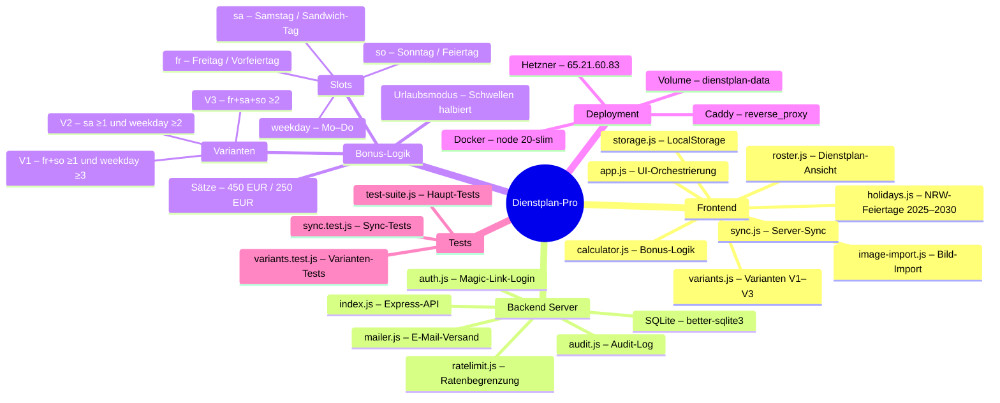

# Dienstplan-Pro — Mindmap

Generiert am 2026-08-11 mit `opencode/mimo-v2.5-free` (headless).

```mermaid
mindmap
  root((Dienstplan-Pro))
    Frontend
      app.js – UI-Orchestrierung
      calculator.js – Bonus-Logik
      variants.js – Varianten V1–V3
      holidays.js – NRW-Feiertage 2025–2030
      storage.js – LocalStorage
      sync.js – Server-Sync
      roster.js – Dienstplan-Ansicht
      image-import.js – Bild-Import
    Backend Server
      auth.js – Magic-Link-Login
      index.js – Express-API
      mailer.js – E-Mail-Versand
      ratelimit.js – Ratenbegrenzung
      audit.js – Audit-Log
      SQLite – better-sqlite3
    Bonus-Logik
      Slots
        fr – Freitag / Vorfeiertag
        sa – Samstag / Sandwich-Tag
        so – Sonntag / Feiertag
        weekday – Mo–Do
      Varianten
        V1 – fr+so ≥1 und weekday ≥3
        V2 – sa ≥1 und weekday ≥2
        V3 – fr+sa+so ≥2
      Urlaubsmodus – Schwellen halbiert
      Sätze – 450 EUR / 250 EUR
    Deployment
      Docker – node 20-slim
      Hetzner – 65.21.60.83
      Caddy – reverse_proxy
      Volume – dienstplan-data
    Tests
      test-suite.js – Haupt-Tests
      variants.test.js – Varianten-Tests
      sync.test.js – Sync-Tests
```
